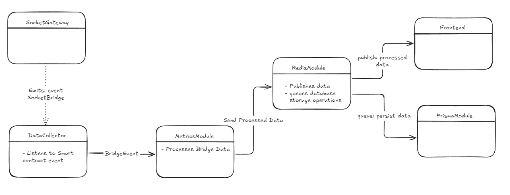

<div align="center">

# 🌉 Bridging Event Service 🌉

### Real-Time Monitoring of Bridged Tokens

The **Bridging Event Service** is a backend system designed for real-time monitoring of bridged tokens. It collects, processes, and serves live updates on token bridging events using WebSocket and RESTful APIs. It also stores historical data for analytics and reporting.

🌐 **Hosted Version**:  
Explore the live version of the service [here](https://sockettech.vercel.app/).

---

## Technologies Used

<p align="center" style="display: flex; justify-content: center; gap: 20px;">
  
  
  
  
  
  
  
</p>

</div>

---

## 📊 Architecture Overview

<p align="center">
  
</p>

The application operates as follows:

1. **Data Collection:** The system listens for real-time events emitted from the SocketGateway smart contract.
2. **Data processing:** Captured events are processed and dispatched to the Redis module for efficient handling.
3. **Data Publishing and Persistence:** Data is temporarily stored in Redis for fast in-memory access and live updates. A Bull Queue worker processes the Redis-stored data to ensure consistency and persistence in a PostgreSQL database.
4. **API Layer:** The processed data is exposed via RESTful API endpoints for historical and live analytics.
5. **WebSocket Streams:** Real-time updates are sent to connected clients for visualization on a live dashboard.

---

## 🚀 Setup and Launch

### **Note**

**Docker is used for convenience purposes**—preconfigured passwords, users, and databases are already set in the included `docker-compose.yml`.  
If you choose **not** to use Docker, you'll need to install and run PostgreSQL and Redis manually, replacing the environment variables with your own credentials.

---

### 🔧 Prerequisites

- **Node.js** (>= 16.x)
- **Docker** (optional but recommended for containerized setup)

---

### 🐋 Option 1: **With Docker (Recommended)**

#### Environment Variables

Update the `.env` file with the required environment variable:

```plaintext
ETH_RPC_URL=<your_ethereum_rpc_url>
```

Replace `<your_ethereum_rpc_url>` with a valid Ethereum RPC URL (e.g., from Infura or Alchemy).

1. Clone the repository:
   ```bash
   git clone https://github.com/quent043/bridging-event-service.git
   cd bridging-event-service
   ```

2. Install dependencies:
   ```bash
   npm install
   ```

3. Start the service:
   ```bash
   npm run start:with-docker
   ```

The backend server will be running at `http://localhost:3000`.

---

### 🐧 Option 2: **Without Docker**

#### Environment Variables

Update the `.env` file with the required environment variables:

```plaintext
ETH_RPC_URL=<your_ethereum_rpc_url>
DATABASE_URL=<your_postgresql_url>
REDIS_URL=<your_redis_url>
```

- Replace `<your_ethereum_rpc_url>` with a valid Ethereum RPC URL (e.g., from Infura or Alchemy).
- Replace `<your_postgresql_url>` with your PostgreSQL database connection string (e.g., postgres://<user>:<password>@<host>:<port>/<database>).
- Replace `<your_redis_url>` with your Redis connection string (e.g., <username>:<password>@<host>:<port>).


1. Clone the repository:
   ```bash
   git clone https://github.com/quent043/bridging-event-service.git
   cd bridging-event-service
   ```

2. Install dependencies:
   ```bash
   npm install
   ```

3. Install and configure PostgreSQL and Redis manually.

4. Update the `.env` file with the required environment variables (as detailed above).

5. Run database migrations:
   ```bash
   npm run db:setup
   ```

6. Start the backend server:
   ```bash
   npm run start:dev
   ```

The backend server will be running at `http://localhost:3000`.

---

## 📈 API Endpoints

### REST Endpoints

1. **GET `/metrics/total_volume`**
   - **Description:** Retrieves the total volume of all bridged tokens.
   - **Example Response:**
     ```json
     {
       "message": "Total volume retrieved successfully",
       "data": {
         "0xTokenAddress1": 123456789.01,
         "0xTokenAddress2": 987654321.99
       }
     }
     ```

2. **GET `/metrics/total_transactions_by_chain`**
   - **Description:** Retrieves the total count of transactions of tokens bridged per chain.
   - **Example Response:**
     ```json
     {
       "message": "Total transactions count by chain retrieved successfully",
       "data": {
         "1": 1234,
         "137": 987654
       }
     }
     ```

3. **GET `/metrics/bridge_usage`**
   - **Description:** Retrieves the usage count for each bridge.
   - **Example Response:**
     ```json
     {
       "message": "Bridge usage counts retrieved successfully",
       "data": {
         "BridgeName1": 150,
         "BridgeName2": 75
       }
     }
     ```

---

### 🔌 WebSocket

The WebSocket streams live updates for token and chain volumes, as well as bridge usage counts.

- **Connection URL:** `ws://localhost:3000`
- **Events:**
   - `token_volume_update`: Provides updates for token volumes.
   - `transactions_per_chain_update`: Provides updates for chain transaction count.
   - `bridge_usage_update`: Provides updates for bridge usage counts.

**Example WebSocket Integration:**

```javascript
import { io } from "socket.io-client";

const socket = io("http://localhost:3000");

// Listen for token volume updates
socket.on("token_volume_update", ({ token, totalVolume }) => {
  console.log(`Token: ${token}, Volume: ${totalVolume}`);
});

// Listen for chain transaction count updates
socket.on("transactions_per_chain_update", ({ chainId, txCount }) => {
  console.log(`Chain: ${chainId}, Volume: ${txCount}`);
});

// Listen for bridge usage updates
socket.on("bridge_usage_update", ({ bridgeName, usageCount }) => {
  console.log(`Bridge: ${bridgeName}, Usage Count: ${usageCount}`);
});
```

---

## 🖥️ Demo Frontend Integration

A live frontend dashboard for the Bridging Event Service is available here:

**[Frontend Repository](https://github.com/quent043/bridging-event-service-frontend)**

### Frontend Setup

1. Clone the frontend repository:
   ```bash
   git clone https://github.com/quent043/bridging-event-service-frontend.git
   cd bridging-event-service-frontend
   ```

2. Install dependencies:
   ```bash
   npm install
   ```

3. Start the development server:
   ```bash
   npm run dev
   ```

The dashboard will be available at `http://localhost:3001`.
